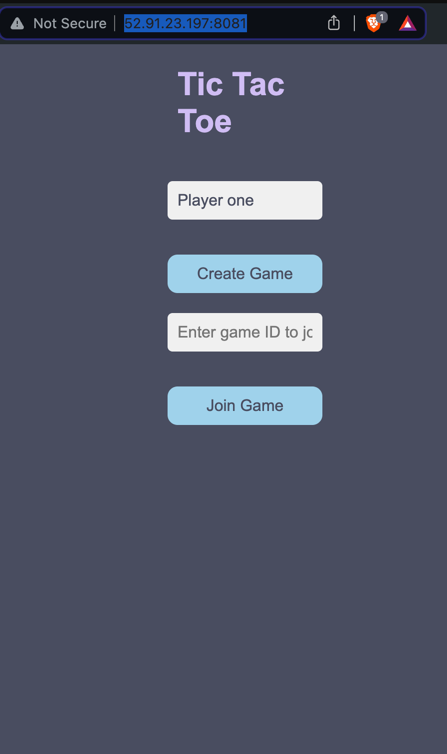
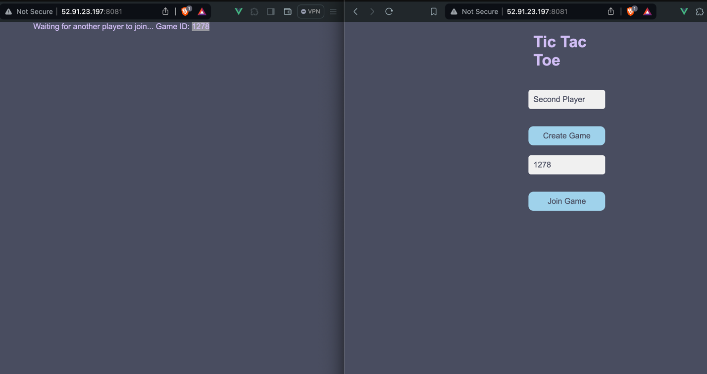
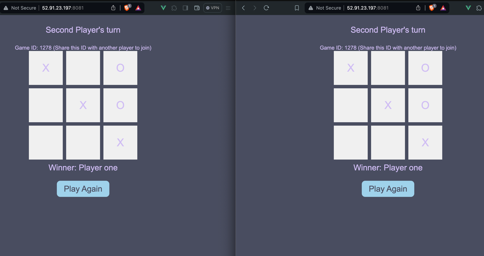

# Wojciech Skuła - Terraform, EC2, TicTacToe report

- Course: *Cloud programming*
- Group: Group 4 
- Date: 22.04.2024

## Environment architecture

Description and scheme of the developed infrastructure.

- Virtual Private Cloud (VPC): A VPC named "TicTacToeVPC" is created with a CIDR block of 10.0.0.0/16, enabling both DNS support and hostnames
- Subnet: Inside the VPC, a subnet named "TicTacToeSubnet" is defined in the us-east-1a availability zone with a CIDR block of 10.0.1.0/24. This subnet is configured to automatically assign public IP addresses to instances launched within it, facilitating direct access to the internet.
- Internet Gateway (IGW): An internet gateway named "TicTacToeIGW" is attached to the VPC, enabling communication between resources within the VPC and the internet.
- Route Table: A route table named "TicTacToeRouteTable" is associated with the VPC to direct all traffic (0.0.0.0/0) to the internet gateway, thus allowing outbound internet access.
- Route Table Association: This ensures that the route table is associated with the subnet, effectively applying the routing rules to the subnet.
- Security Group: Named "TicTacToeSG", this security group is attached to the VPC and configures both ingress and egress rules:
- Ingress: Allows incoming traffic on TCP port 22 (SSH), 80 (HTTP), and a range from 8080 to 8081 for application-specific access.
- Egress: Allows all outgoing traffic from any port to any destination.
- EC2 Instance: An AWS EC2 instance named "TicTacToeInstance" is launched within the subnet using an ami-080e1f13689e07408, of type t2.micro, and associated with the defined security group. It is accessible via SSH using a specified key, and executes user data scripts on launch for initial configuration.
## Preview

Screenshots of configured AWS services. Screenshots of your application running.

## Reflections

- What did you learn?
  I learned more about docker-compose and terraform. 
- What obstacles did you overcome?
  I had some issues with configuring dynamic EC2 IP address to pass it as environment variable to the docker container.
  Also, I had issues with cloning the private repository from the EC2 instance. I tried to store the deploy key in SSM parameter store, but I had problems with IAM roles (Access Denied while creating)
- What did you help most in overcoming obstacles?
  Experience from my job
- Was that something that surprised you?
  Not really
